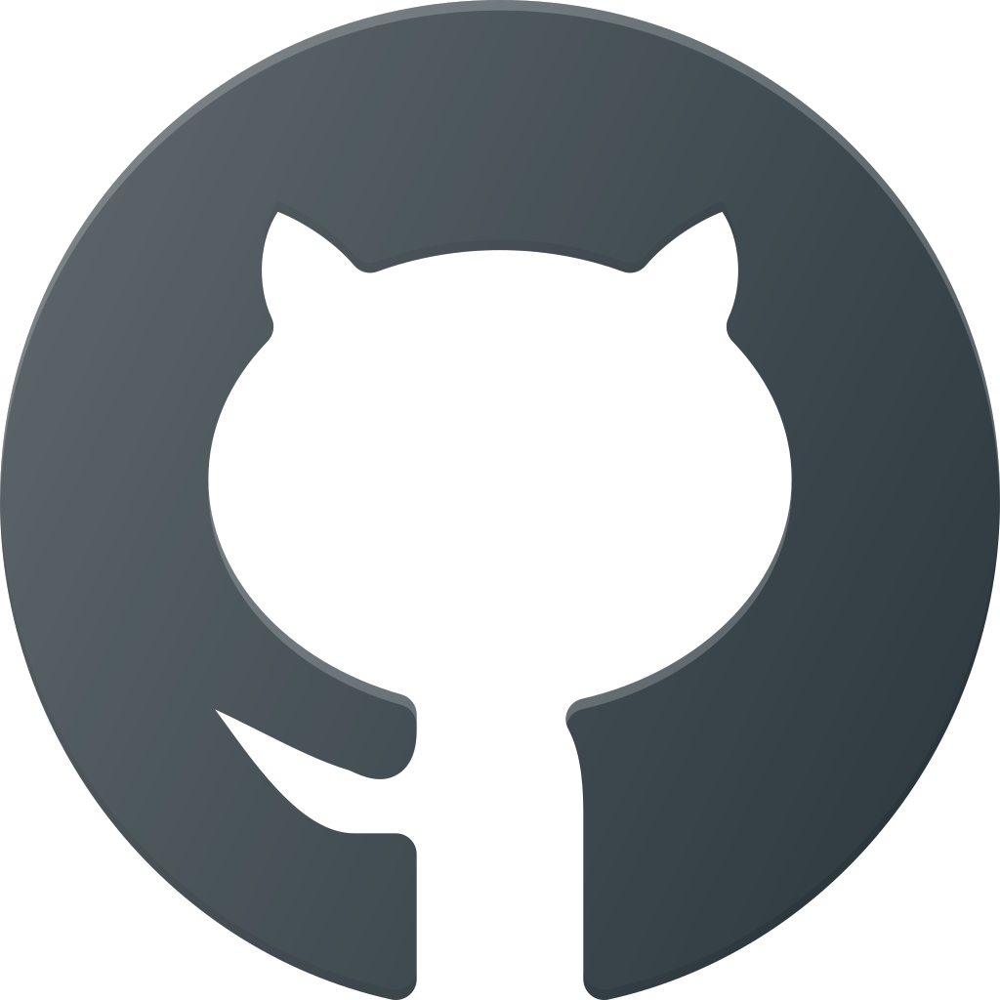

<h1> Hi, I'm alirezakefayati </h1>

<h2 align="center">framework & Languages I use</h2>

    
    
    
    
    

<h2 align="center">me on Social Network</h2>

    
    
    
    
    

<h2 align="center">my project</h2>
